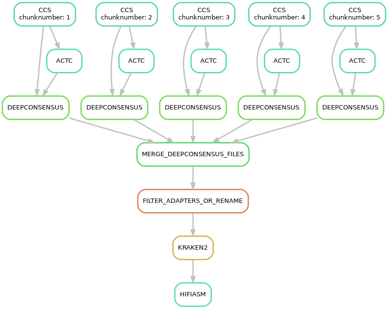
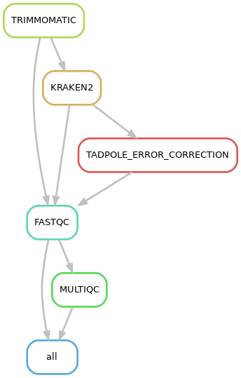

# **Genome Assembly Pipeline**


## **Table of Contents**
- [Input](#input)
- [Dependencies](#dependencies)
- [Testing](#testing)
- [Environment Setup](#environments)
- [Running the Pipeline](#run-pipeline)
- [Pipeline Visualization](#pipeline-visualization)

## Input
- Subreads or fasta hifi reads that must be consolidated into a single file.
- HiC reads should be in two files, {filename}_R1.{fastq|fastq.gz|fq.gz} and {filename}_R2.{fastq|fastq.gz|fq.gz}.

## Dependencies

The following packages need to be set up separately. They can be installed as per the instructions on their respective GitHub pages or in a manner suitable for your system. If your setup differs significantly, you may need to manually adjust the calls to these programs within *`makefiles/STATS.smk`*:

In this pipeline we use them with modules which can be changed in the *config.yaml* file.

- [FastK](https://github.com/thegenemyers/FASTK)
- [MERQURY.FK](https://github.com/thegenemyers/MERQURY.FK)
- [GENESCOPE.FK](https://github.com/thegenemyers/GENESCOPE.FK)
- [GATK 4.4.0.0](https://github.com/broadinstitute/gatk)
- [SALSA2 2.3](https://github.com/marbl/SALSA)

Especially for Merqury, in our system, it runs best when installed locally in your home directory. Initialize it with make after downloading from [here](https://github.com/thegenemyers/MERQURY.FK).

### BUSCO

For [BUSCO](https://busco.ezlab.org/), it's recommended to use it `offline`. Download your relevant lineage from [here](https://busco-data.ezlab.org/v5/data/lineages/), unpack and place in a folder:

```
curl -O <link>
tar -xf <file> # becomes <folder>
mkdir busco_downloads
mkdir busco_downloads/lineages
mv <folder> busco_downloads/lineages
```

Specify the path in the *config.yaml* file.

### Deepconsensus
[Deepconsensus](https://github.com/google/deepconsensus) requires a directory with a model specific to the version used (e.g., 1.2). Download the models from here and place them inside the model folder:

```
wget --no-check-certificate https://storage.googleapis.com/brain-genomics-public/research/deepconsensus/models/v1.2/model_checkpoint/checkpoint.index  ./model/
```

You later need to provide the checkpoint folder  of this model inside the *config.yaml* file.

### Filter PacBio Adapters
Find and save PacBio adapters using the custom script *`utils/pbadapterfilt.sh`*. Rename the result to *`pacbio_vectors_db`* and place it inside the *`DATA/HiFiAdapterFilt/DB/`* folder.

### Kraken decontamination

This pipeline also always runs a decontamination step with kraken2.
You can download a database for kraken2 from [here](https://benlangmead.github.io/aws-indexes/k2) and specify it in the *config.yaml* file together with a confidence score for choosing which reads will be considered classified and unclassified.

## Testing

## Entire pipeline:

To test the entire pipeline you can download data from published assemblies with small genomes.
Note that the input of ccs are circular, raw pacbio reads in `.bam` format.
Example assembly raw data:

`https://www.ebi.ac.uk/ena/browser/view/PRJNA765108`

## Parts of the pipeline
### First part
You can also test the first part of the pipeline, the creation of hifi `.fastq` reads from raw PacBio reads with the 
deepconsensus test data provided from here:

```
https://console.cloud.google.com/storage/browser/brain-genomics-public/research/deepconsensus/test_data?pageState=(%22StorageObjectListTable%22:(%22f%22:%22%255B%255D%22))&prefix=&forceOnObjectsSortingFiltering=false
```

For more info on how to test this part of the pipeline see the deepconsensus github:

`https://github.com/google/deepconsensus/blob/r1.2/docs/quick_start.md`

### HiC editing
 
This pipeline also includes an optional file for processing HiC reads, *`PROCESS_HIC_READS.smk`*. Test this by subsampling your own HiC paired-end Illumina reads with `seqtk sample` or by using data from a public database.

The purpose of this pipeline is to trim, decontaminate and error correct the HiC files and estimate how much they been improved. The user can then use the version of the HiC reads they prefer.

## Environment(s)

In order to run the pipeline, you need a basic conda environment with python>=3.9 and mamba on your system. 
You can create that with:

```
conda create -y -n genome_assembly "python>=3.9" "mamba>=0.22.1" -c conda-forge -c bioconda -c defaults
conda activate genome_assembly
```

You can then use install the environments used by the different rules of the pipeline in a terminal with an internet connection:

```
#conda activate genome_assembly
snakemake --snakefile PROCESS_HIC_READS.smk --cores 5 -p -r -w 5 --verbose --use-conda  --conda-create-envs-only
```

This can take several minutes and needs to be done every time the environment files are changed.

## Test run:

```
snakemake -s snakefile.smk --dry-run --cores 5 -p -r -w 5 --verbose
```

## Run pipeline:
You can then run the pipeline with:

```
snakemake \
    --snakefile snakefile.smk \
    --keep-going \
    --latency-wait 300 \
    -j ${THREADS} \
    --default-resources "tmpdir='/path/to/tmp'" \
    --verbose \
    --use-conda \
    --use-envmodules \
    --printshellcmds \
    --reason \
    --nolock \
    --rerun-triggers mtime \
    --rerun-incomplete \
    --stats "./stats.json" \
    --report "./report.html"
```

## Visualize the steps of the pipeline:

You can create a represenation of the pipeline with:
```
snakemake -s snakefile.smk --dag --forceall | dot -Tpng > graph_of_jobs.png
snakemake -s snakefile.smk --dag --until HIFIASM | dot -Tpng > graph_of_jobs_hifiasm.png
snakemake -s snakefile.smk --filegraph --forceall | dot -Tpng > filegraph_all.png
snakemake -s snakefile.smk --rulegraph --forceall | dot -Tpng > rulegraph_all.png

snakemake -s PROCESS_HIC_READS.smk --rulegraph --forceall | dot -Tpng > rulegraph_hic_editing.png
```

---

### First part of pipeline:

 

---

### HiC editing pipeline


